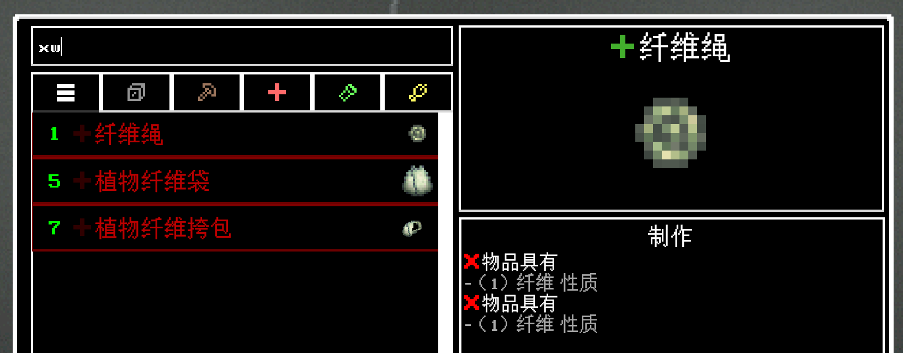

# Just Unknown Characters

Casualties Unknown（未知伤亡）的拼音搜索模组 — 在合成界面搜索框中支持使用拼音筛选中文配方。

- **全拼**: `shengzi` → 绳子
- **首字母**: `sz` → 绳子
- **混合输入**: `绳zi`、`sheng子`



## 前置依赖

- [BepInEx](https://bepinex.org/) 5.x（需预先安装在游戏目录）

## 安装

1. 从 [Releases](../../releases) 下载 `JustUnknownCharacters.dll`
2. 放入 `Casualties Unknown Demo\BepInEx\plugins\`

## 构建

构建前需在 `lib/` 目录放置游戏 DLL（详见 `lib/README.txt`）：

- `Assembly-CSharp.dll`、`UnityEngine.dll`、`UnityEngine.CoreModule.dll`（来自 `CasualtiesUnknown_Data\Managed\`）
- `0Harmony.dll`（来自 `BepInEx\core\`）
- `netstandard.dll`（来自 `CasualtiesUnknown_Data\Managed\`，Unity Mono 兼容层）

```bash
dotnet restore
dotnet build -c Release
```

输出：`src/bin/Release/net452/JustUnknownCharacters.dll`

## 致谢

本模组的拼音搜索算法和字典数据基于 [Just Enough Characters](https://github.com/Towdium/JustEnoughCharacters) 及其核心库 [PinIn](https://github.com/Towdium/PinIn)，由 [Towdium](https://github.com/Towdium) 开发。

`Resources/pinyin_data.txt` 直接取自 PinIn 项目，匹配逻辑为 PinIn 的 NFA 音素回溯算法的 C# 移植。感谢 Towdium 的开源贡献。

## 许可

[MIT](LICENSE)
